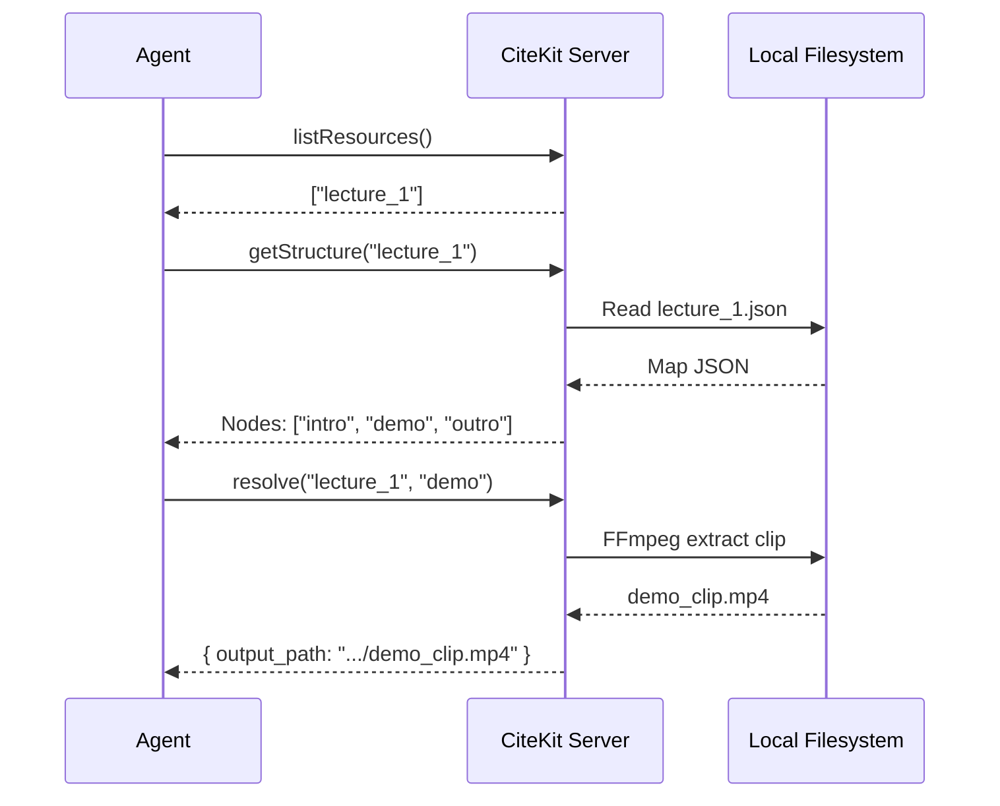

# MCP Tools Reference

The CiteKit MCP server exposes four powerful tools that agents use to perform discovery and resolution.

## `listResources`

**Responsibility**: Discovery. Let the agent know what files are indexed and available.

### Schema
- **Input**: `{}`
- **Output**: 
  ```json
  {
    "resources": ["string", "string"]
  }
  ```

---

## `getStructure`

**Responsibility**: Contextualization. Returns the full semantic tree of a resource.

### Schema
- **Input**: 
  ```json
  {
    "resource_id": "string"
  }
  ```
- **Output**: A complete [ResourceMap](/api/models) object.

---

## `getNode`

**Responsibility**: Verification. Returns metadata for a single node.

### Schema
- **Input**: 
  ```json
  {
    "resource_id": "string",
    "node_id": "string"
  }
  ```
- **Output**: A single [Node](/api/models#the-node-schema) object.

---

## `resolve`

**Responsibility**: Evidence Extraction. The core workhorse.

### Schema
- **Input**: 
  ```json
  {
    "resource_id": "string",
    "node_id": "string",
    "virtual": "boolean (optional, default: false)"
  }
  ```
- **Output**: A [ResolvedEvidence](/api/models#resolved-evidence) object.

| Resolution Mode | Output Path | Address |
| :--- | :--- | :--- |
| **Physical** | Absolute local path | URI Pointer |
| **Virtual** | `null` | URI Pointer |

---

## Protocol Lifecycle


