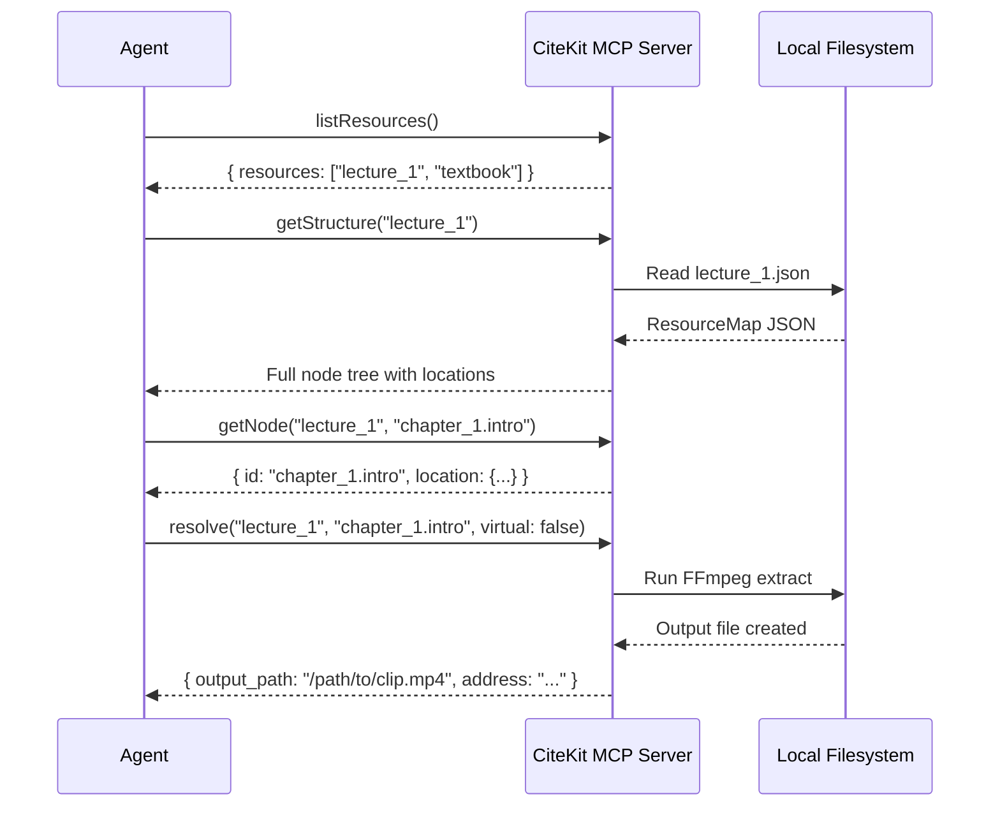

# MCP Tools Reference — Complete API

The CiteKit MCP server exposes four powerful tools that agents use to perform discovery, contextualization, verification, and evidence extraction.

---

## Protocol Overview



---

## Tool 1: `listResources`

**Responsibility**: Discovery. Enumerate all indexed resources available to agents.

### Input Schema

```json
{}
```

No parameters required.

### Output Schema

```json
{
  "resources": ["string", "string", ...]
}
```

**Response Fields:**
- `resources` (array[string]): List of resource IDs currently stored in `.resource_maps/`

### Examples

**Request**:
```json
{
  "tool": "listResources",
  "input": {}
}
```

**Response**:
```json
{
  "resources": [
    "lecture_01",
    "textbook",
    "codebase_v2",
    "research_paper"
  ]
}
```

**Empty Response**:
```json
{
  "resources": []
}
```

### Errors

Errors are returned as plain text in the tool response:

```
Error: <message>
```

---

## Tool 2: `getStructure`

**Responsibility**: Contextualization. Return the full semantic tree of a resource so agents understand its structure.

### Input Schema

```json
{
  "resource_id": "string"
}
```

**Input Fields:**
- `resource_id` (string, required): The resource ID to retrieve

### Output Schema

```json
{
  "resource_id": "string",
  "type": "document|video|audio|image|text|virtual",
  "title": "string",
  "source_path": "string",
  "nodes": [
    {
      "id": "string",
      "title": "string",
      "type": "string",
      "location": {
        "modality": "string",
        "start": "number (optional)",
        "end": "number (optional)",
        "pages": ["number", "..."],
        "lines": ["number", "number"],
        "bbox": ["number", "number", "number", "number"],
        "virtual_address": "string"
      },
      "summary": "string (optional)",
      "children": [...] (optional)
    }
  ],
  "metadata": {},
  "created_at": "string (ISO 8601)"
}
```

**Response is the complete `ResourceMap`** — agents can traverse the entire hierarchy and plan resolution queries. Fields are optional based on modality.

### Examples

**Request**:
```json
{
  "tool": "getStructure",
  "input": {
    "resource_id": "lecture_01"
  }
}
```

**Response**:
```json
{
  "resource_id": "lecture_01",
  "type": "video",
  "title": "Introduction to Algorithms",
  "source_path": "/home/user/videos/lecture_01.mp4",
  "metadata": {
    "source_hash": "a1b2c3d4...",
    "source_size": 1024000000
  },
  "nodes": [
    {
      "id": "intro",
      "title": "Introduction",
      "type": "section",
      "location": {
        "modality": "video",
        "start": 0.0,
        "end": 145.5
      },
      "summary": "Course overview and objectives",
      "children": [
        {
          "id": "intro.welcome",
          "title": "Welcome",
          "type": "example",
          "location": {"modality": "video", "start": 0.0, "end": 30.0},
          "children": []
        }
      ]
    },
    {
      "id": "chapter_1",
      "title": "Big O Notation",
      "type": "section",
      "location": {"modality": "video", "start": 145.5, "end": 285.0},
      "summary": "Asymptotic runtime analysis",
      "children": []
    }
  ],
  "created_at": "2025-02-16T14:32:10Z"
}
```

### Errors

**Resource not found**:
```
Error: No map found for resource 'nonexistent_id'. Expected at: .resource_maps/nonexistent_id.json
```

---

## Tool 3: `getNode`

**Responsibility**: Verification. Return metadata for a single node (without the entire tree).

### Input Schema

```json
{
  "resource_id": "string",
  "node_id": "string"
}
```

**Input Fields:**
- `resource_id` (string, required): The resource ID
- `node_id` (string, required): The node ID (e.g., `chapter_1.intro`)

### Output Schema

```json
{
  "id": "string",
  "title": "string",
  "type": "string",
  "location": {
    "modality": "string",
    "start": "number (optional)",
    "end": "number (optional)",
    "pages": ["number", "..."],
    "lines": ["number", "number"],
    "bbox": ["number", "number", "number", "number"],
    "virtual_address": "string"
  },
  "summary": "string (optional)",
  "children": [...]  (optional, just IDs)
}
```

**Response is a single `Node` object** — faster than `getStructure` for specific node lookups. Fields are optional based on modality.

### Examples

**Request**:
```json
{
  "tool": "getNode",
  "input": {
    "resource_id": "lecture_01",
    "node_id": "chapter_1.intro"
  }
}
```

**Response**:
```json
{
  "id": "chapter_1.intro",
  "title": "Introduction to Big O",
  "type": "definition",
  "location": {
    "modality": "video",
    "start": 145.5,
    "end": 200.0
  },
  "summary": "Defines asymptotic notation and common complexity classes",
  "children": [
    {"id": "chapter_1.intro.example_1"},
    {"id": "chapter_1.intro.example_2"}
  ]
}
```

### Errors

**Node not found**:
```
Error: Node 'invalid.node' not found.
```

**Resource not found**:
```
Error: Resource 'nonexistent' not found.
```

---

## Tool 4: `resolve`

**Responsibility**: Evidence Extraction. The core workhorse — extracts physical segments or returns virtual addresses.

### Input Schema

```json
{
  "resource_id": "string",
  "node_id": "string",
  "virtual": "boolean (optional, default: false)"
}
```

**Input Fields:**
- `resource_id` (string, required): The resource ID
- `node_id` (string, required): The node ID to resolve
- `virtual` (boolean, optional): If `true`, return address without extraction

### Output Schema

```json
{
  "output_path": "string or null",
  "modality": "string",
  "address": "string",
  "node": {
    "id": "string",
    "title": "string",
    "type": "string",
    "location": {...},
    "summary": "string (optional)"
  },
  "resource_id": "string"
}
```

**Response Fields:**
- `output_path` (string|null): Path to extracted file (null if `virtual=true`)
- `modality` (string): Node's modality (video, document, text, etc.)
- `address` (string): CiteKit URI address (e.g., `video://lecture_01#t=145-200`)
- `node` (Node): The resolved node object
- `resource_id` (string): The resource ID

### Examples

**Request: Physical Resolution**
```json
{
  "tool": "resolve",
  "input": {
    "resource_id": "lecture_01",
    "node_id": "chapter_1.intro",
    "virtual": false
  }
}
```

**Response: Physical Resolution**
```json
{
  "output_path": ".citekit_output/lecture_01_chapter_1_intro.mp4",
  "modality": "video",
  "address": "video://lecture_01#t=145-200",
  "node": {
    "id": "chapter_1.intro",
    "title": "Introduction to Big O",
    "type": "definition",
    "location": {"modality": "video", "start": 145.5, "end": 200.0},
    "summary": "Defines asymptotic notation"
  },
  "resource_id": "lecture_01"
}
```

**Request: Virtual Resolution**
```json
{
  "tool": "resolve",
  "input": {
    "resource_id": "lecture_01",
    "node_id": "chapter_1.intro",
    "virtual": true
  }
}
```

**Response: Virtual Resolution**
```json
{
  "output_path": null,
  "modality": "video",
  "address": "video://lecture_01#t=145-200",
  "node": {...},
  "resource_id": "lecture_01"
}
```

**Request: Document Resolution**
```json
{
  "tool": "resolve",
  "input": {
    "resource_id": "textbook",
    "node_id": "chapter_2.definition"
  }
}
```

**Response: Document Resolution**
```json
{
  "output_path": ".citekit_output/textbook_chapter_2_definition.pdf",
  "modality": "document",
  "address": "doc://textbook#pages=12-15",
  "node": {
    "id": "chapter_2.definition",
    "location": {"modality": "document", "pages": [12, 15]}
  },
  "resource_id": "textbook"
}
```

### Errors

Errors are returned as plain text in the tool response:

```
Error: <message>
```

---

## Resolution Modes

| Mode | `virtual` | `output_path` | Speed | Use Case |
| :--- | :--- | :--- | :--- | :--- |
| **Physical** | `false` | Local path | 1-30s | Actual evidence needed |
| **Virtual** | `true` | `null` | ~10ms | Citations, citations-only |

---

## Agent Integration Example

```python
# Example agent using CiteKit MCP tools

from mcp import Client

client = Client("citekit")

# 1. Discover available resources
resources_resp = client.call_tool("listResources", {})
print(f"Available: {resources_resp['resources']}")
# → ["lecture_01", "textbook"]

# 2. Get full structure of a resource
struct = client.call_tool("getStructure", {"resource_id": "lecture_01"})
print(f"Nodes: {[n['id'] for n in struct['nodes']]}")
# → ["intro", "chapter_1", "chapter_2", "conclusion"]

# 3. Check a specific node
node = client.call_tool("getNode", {
    "resource_id": "lecture_01",
    "node_id": "chapter_1"
})
print(f"Node: {node['title']} ({node['location']['start']}-{node['location']['end']}s)")

# 4. Resolve the node (virtual for fast citations)
evidence = client.call_tool("resolve", {
    "resource_id": "lecture_01",
    "node_id": "chapter_1",
    "virtual": True
})
print(f"Citation: {evidence['address']}")
# → "video://lecture_01#t=145-285"

# 5. Later, physical extraction if needed
evidence = client.call_tool("resolve", {
    "resource_id": "lecture_01",
    "node_id": "chapter_1",
    "virtual": False
})
print(f"File: {evidence['output_path']}")
# → ".citekit_output/lecture_01_chapter_1.mp4"
```

---

## Performance Targets

| Operation | Latency | Notes |
| :--- | :--- | :--- |
| `listResources` | <10ms | Memory-resident list |
| `getStructure` | 10-50ms | Disk read + JSON parse |
| `getNode` | <5ms | Fast lookup in tree |
| `resolve` (virtual) | ~10ms | No extraction |
| `resolve` (physical) | 1-30s | Depends on file size, codec |

---

## Error Handling Pattern (for agents)

```python
def resolve_safely(resource_id: str, node_id: str):
    try:
        # Try virtual first (fast, for citations)
        evidence = client.call_tool("resolve", {
            "resource_id": resource_id,
            "node_id": node_id,
            "virtual": True
        })
        return evidence["address"]  # Quick citation
        
    except Exception as e:
        print(f"Virtual resolution failed: {e}")
        
        # Fall back to physical if needed
        try:
            evidence = client.call_tool("resolve", {
                "resource_id": resource_id,
                "node_id": node_id,
                "virtual": False
            })
            return evidence["output_path"]  # Actual file
        except Exception as e2:
            print(f"Physical resolution failed: {e2}")
            return None
```
