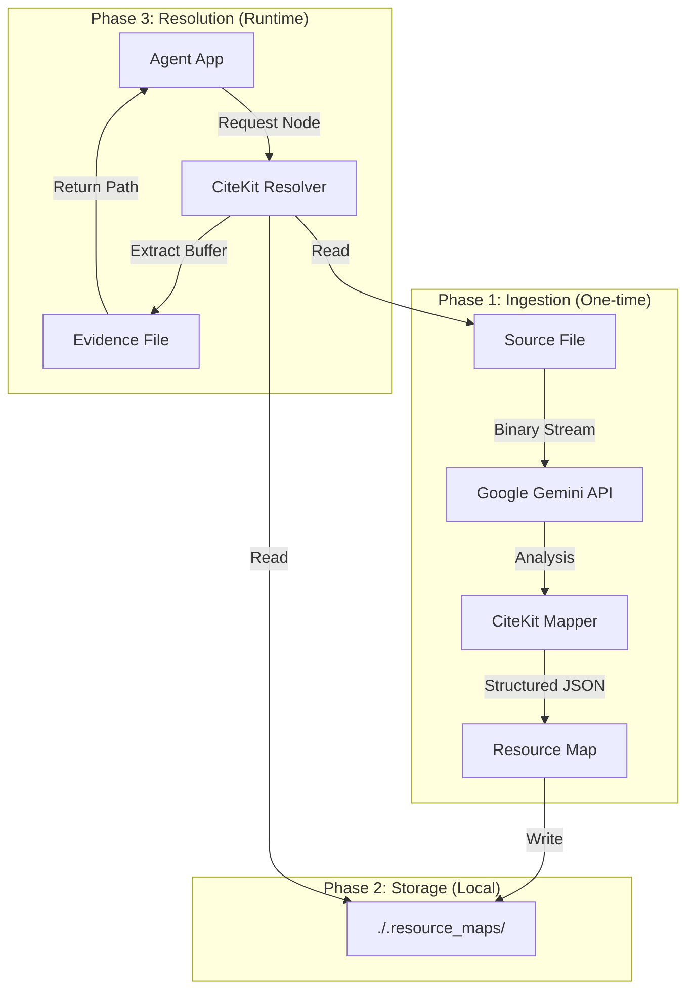

# Architecture

CiteKit is designed as a **two-phase local-first** system. It separates the expensive, slow process of specific *finding* content from the cheap, fast process of *retrieving* it.

## High-Level Design

The system consists of three main components:

1.  **Ingestion Engine**: Interfaces with Multimodal LLMs (Gemini) to generate semantic maps.
2.  **Map Storage**: A local JSON-based storage for persisting content structure.
3.  **Resolution Engine**: A local media processing layer (FFmpeg, PyMuPDF) for extracting content.

<div class="mermaid-container" style="width: 100%; display: flex; justify-content: center;">



</div>

## 1. The Ingestion Engine

The ingestion process enables "blind" agents to understand file content.

-   **Input**: A file path (PDF, MP4, MP3, JPG).
-   **Process**:
    1.  The file is uploaded to Google's GenAI File API (temporarily).
    2.  CiteKit prompts a Gemini 1.5 model with a domain-specific schema instruction.
    3.  The model returns a hierarchical JSON structure representing the file's content (Topics, Chapters, Scenes).
    4.  The remote file is deleted from Google's servers (depending on retention policy, usually immediate for temp files).

## 2. Resource Maps (.resource_maps)

The core data structure in CiteKit is the **Resource Map**. It is a normalized JSON format that describes *where* information lives within a file.

Example Structure:
```json
{
  "resource_id": "research_paper_v1",
  "source_path": "abs/path/to/paper.pdf",
  "metadata": { "title": "Attention Is All You Need", "type": "pdf" },
  "nodes": [
    {
      "id": "intro",
      "title": "Introduction",
      "location": { "pages": [1] },
      "context": "Discussion of RNNs and CNNs..."
    },
    {
      "id": "architecture",
      "title": "Model Architecture",
      "location": { "pages": [3, 4, 5] },
      "context": "Detailed diagram of Transformer..."
    }
  ]
}
```

This map allows an agent to "read" the entire structure of a 50-page document in ~500 tokens.

## 3. The Resolution Engine

The resolution engine is completely local and offline. It uses specialized libraries to extract byte-perfect segments based on the map's coordinates.

| Modality | Backend Engine | Operation |
| :--- | :--- | :--- |
| **PDF** | `PyMuPDF` / `pdf-lib` | Extracts page ranges into a new single-file PDF. |
| **Video** | `ffmpeg` | Performs stream copy (`-c copy`) for instant cutting without re-encoding. |
| **Audio** | `ffmpeg` | Trims audio streams to specified timestamps. |
| **Image** | `Pillow` / `sharp` | Crops images to specified bounding boxes. |

## Data Flow

1.  **Developer** calls `client.ingest("video.mp4")`.
2.  **CiteKit** generates `video.json` map.
3.  **Agent** reads `video.json` and decides it needs the "Demo" section (Node ID: `demo_1`).
4.  **Agent** calls `client.resolve("video", "demo_1")`.
5.  **CiteKit** executes: `ffmpeg -ss 120 -to 180 -i video.mp4 -c copy out.mp4`.
6.  **Agent** receives `./.citekit_output/out.mp4` containing only the relevant 60 seconds.

*The same flow applies to Images (Metadata -> Crop) and PDFs (TOC -> Page Extraction).*
