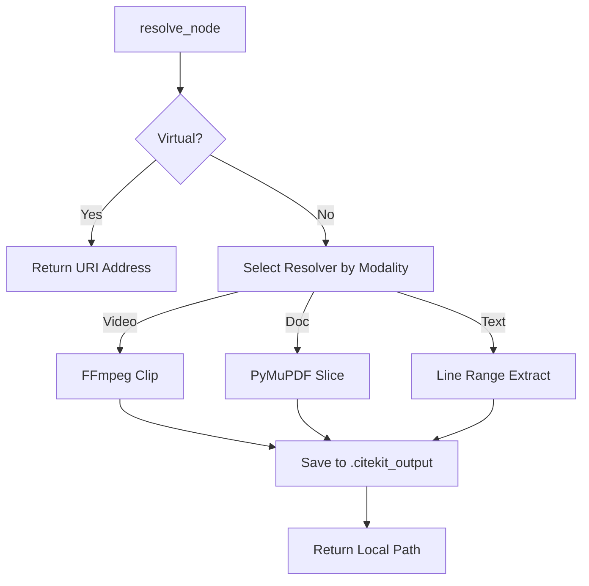

# Technical Deep Dive (Architecture)

This document is for developers who want to understand the inner workings of CiteKit or contribute to the SDKs.

---

## 1. The Ingestion Lifecycle

CiteKit ingestion is designed to be **idempotent**, **concurrency-safe**, and **resilient** to LLM variability.

### Phase A: Identification (Hashing)
Before calling any LLM, CiteKit computes a **SHA-256 hash** of the source file. 
-   **Why?** LLM calls are expensive and slow. If you ingest `lecture.mp4` twice, CiteKit detects the identical hash and returns the previously saved JSON map without cost.

### Phase B: Concurrency Control (Semaphores)
When processing 100 files at once, we must avoid rate-limiting or memory exhaustion.
-   **Python**: Uses `asyncio.Semaphore(limit)`.
-   **JavaScript**: Uses an internal async queue (`withConcurrencyLock`).

### Phase C: Mapper Resiliency (JSON Repair)
LLMs often make small mistakes in JSON formatting (trailing commas, missing closing brackets). The `GeminiMapper` includes a **Repair Layer**:
1.  **Regex Extraction**: Finds the first `[` and last `]` to ignore conversational "chatter".
2.  **Bracket Balancing**: Counts open/close braces and appends missing ones if the LLM was truncated.
3.  **Comma Cleanup**: Removes trailing commas before closing brackets.

---

## 2. The Resolution Lifecycle

Resolution is the bridge between a **Semantic Node** and **Physical Evidence**.

### Modality Resolvers
Resolvers are specialized workers:
-   **VideoResolver**: Executes `ffmpeg -ss {start} -t {duration} -c copy`. It tries "Stream Copy" first (instant). If the file format doesn't support it, it falls back to full re-encoding.
-   **DocumentResolver**: Uses `fitz` (Python) or `pdf-lib` (JS) to perform non-destructive surgery on PDF page trees.
-   **TextResolver**: Performs line-by-line reading to minimize memory footprint for large source files.

---

## 3. Cross-Language Parity

CiteKit maintains strict parity between Python and JavaScript.
-   **Schema**: Both use exact replicates of the `ResourceMap` and `Node` models.
-   **Address Protocol**: The URI encoding logic (`doc://res#pages=1`) is shared to ensure a map generated by Python can be resolved by JS.
-   **Command Parity**: CLI commands map directly to Client methods.

## 4. MCP Integration

The MCP server is a thin wrapper around the `CiteKitClient`.
-   **ListResources**: Maps to `client.list_maps()`.
-   **GetStructure**: Maps to `client.get_structure()`.
-   **getNode**: Maps to `client.resolve(virtual=True)`.

This design allows the same core logic to power CLI, SDK, and Agentic interfaces simultaneously.
