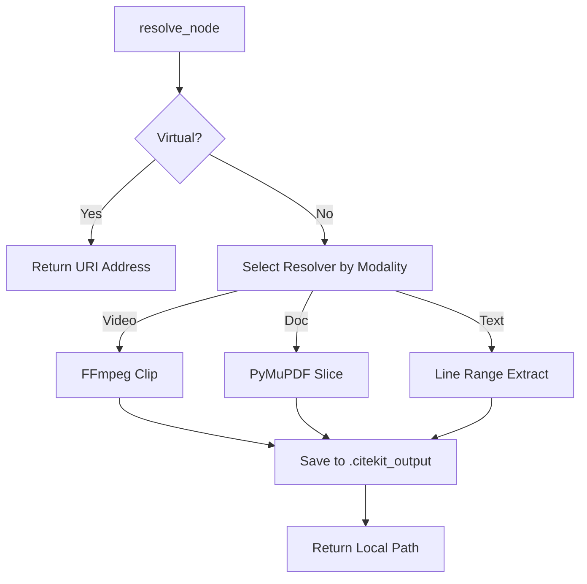

# Technical Deep Dive (Architecture)

This document is for developers who want to understand the inner workings of CiteKit or contribute to the SDKs.

---

## 1. The Ingestion Lifecycle

CiteKit ingestion is designed to be **idempotent**, **concurrency-safe**, and **resilient** to LLM variability.

### Phase A: Identification (Hashing)
Before calling any LLM, CiteKit computes a **SHA-256 hash** of the source file. 
-   **Why?** LLM calls are expensive and slow. If you ingest `lecture.mp4` twice, CiteKit detects the identical hash and returns the previously saved JSON map without cost.

### Phase B: Concurrency Control (Semaphores)
When processing 100 files at once, we must avoid rate-limiting or memory exhaustion.
-   **Python**: Uses `asyncio.Semaphore(limit)`.
-   **JavaScript**: Uses an internal async queue (`withConcurrencyLock`).

### Phase C: Mapper Resiliency (JSON Repair)
LLMs often make small mistakes in JSON formatting (trailing commas, missing closing brackets). The default `GeminiMapper` includes a **Repair Layer** that follows this priority sequence. Custom mappers can implement similar repair logic.

1.  **Strict Cleaning**: Uses regex to strip any text before the first `{` or `[` and after the last equivalent symbol.
2.  **Bracket Healing**: If parsing fails, the engine performs a "stack-based count" of braces. If unbalanced, it appends the necessary closing characters to form a valid (even if truncated) object.
3.  **Syntax Normalization**: Automatically replaces common LLM pitfalls like single quotes (`'`) with double quotes (`"`) and removes trailing commas.

---

## 2. The Resolution Lifecycle

Resolution is the bridge between a **Semantic Node** and **Physical Evidence**.

### Modality Resolvers & Contracts
All resolvers must adhere to the **Zero-Corruption Contract**:
-   **Atomic Writes**: Output files are written to a temporary location first, then moved to the final path to prevent "partial clips" if the process is killed.
-   **Video**: Uses `ffmpeg -ss {start} -t {duration} -c copy`. CiteKit prefers "Stream Copy" (instant) but fallback to transcode if the slice point is not a keyframe.
-   **Document**: Performs **page-tree extraction**. It doesn't just "print" pages; it preserves internal links and metadata between the sliced pages.

---

## 3. Error Protocols

CiteKit defines standard exception behaviors to help developers build resilient agents.

| Failure | SDK Behavior | Recommended Action |
| :--- | :--- | :--- |
| **API Rate Limit** | Retries with exponential backoff (1s, 2s, 4s). | Increase `concurrency_limit` to manage throughput. |
| **FFmpeg Missing** | Raises `RuntimeError` (Py) or `Error` (JS). | Ensure system dependencies are in `PATH`. |
| **Broken JSON** | Triggers Repair Engine. If still un-parsable, fails. | Check model safety filters or output truncation. |
| **Invalid Coordinates**| Normalizes (e.g., negative page becomes 1). | Audit the `Mapper` prompt. |

---

## 4. Why this Architecture?

-   **Why Hashing?** To enable "Virtual Grounding." You can store a 50KB JSON map in a DB and never touch a 5GB video file until the exact moment of resolution.
-   **Why 1-indexed Pages?** Human/User parity. LLMs think in humans terms; users read in human terms. Translating to 0-indexing internally causes frequent "off-by-one" hallucinations in agents.
